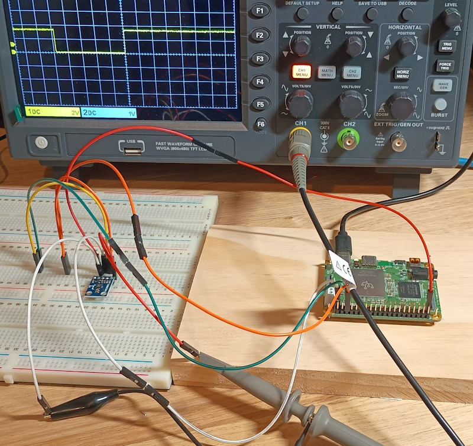

# Coral Dev Mini And HMC5883L Driver #

This is demonstrates a custom i2c bus and HMC5883L driver for linux using a coral dev mini. The i2c bus uses i2c-gpio rather than bit banging.The module communicates to the HMC5883L via i2c while the user communicates with the module via ioctl.

This demonstrates it's possible to create custom SCL and SDA lines from generic GPIO pins. You could of course just use the dedicated SCL and SDA pins if they are available. This project is overkill for simple use cases, the user could just talk to the sensor via built-in i2c.

The image shows the data ready line indicating data is ready to be read from the registers.



### Hardware Used ###
* Coral Dev Mini
* Arduino
* Ubuntu Machine

### Getting Coral Setup for Compilation ### 
These instructions are for compiling on the coral dev board rather than cross compiling.
The kernel headers will need to be copied to the board. These are found in the build directory after compiling the firmware. In my case these were:
* ```linux-headers-4.19.125-mtk_4-2_arm64.deb```
* ```linux-kbuild-4.19.125-mtk_4-2_arm64.deb```

Transfer these files using ```mdt push``` then install them.

### Connecting Everything ###
Connect the sensor before running the modules. They haven't been written or tested to handle connecting and disconnecting hardware after loading modules. The SDA and SCL pins are defined in the custom i2c bus driver.

### Build The Modules and App ### 
* Build the modules and app with ```make```
* Install the modules with ```insmod <module_name>```

If everything has gone well then ```dmesg``` will show:
```
Initialising I2C bus driver
I2C bus driver Initialised
Custom Bus Driver Added
Transfered data
Transfered data
Transfered data
HMC5883L initialised
Major = 242 Minor = 0 
HMC5883L Char Device Driver Initialised
HMC5883L Driver Added
```

### Running The App ### 
Running the app will simply print out raw data from the sensor.